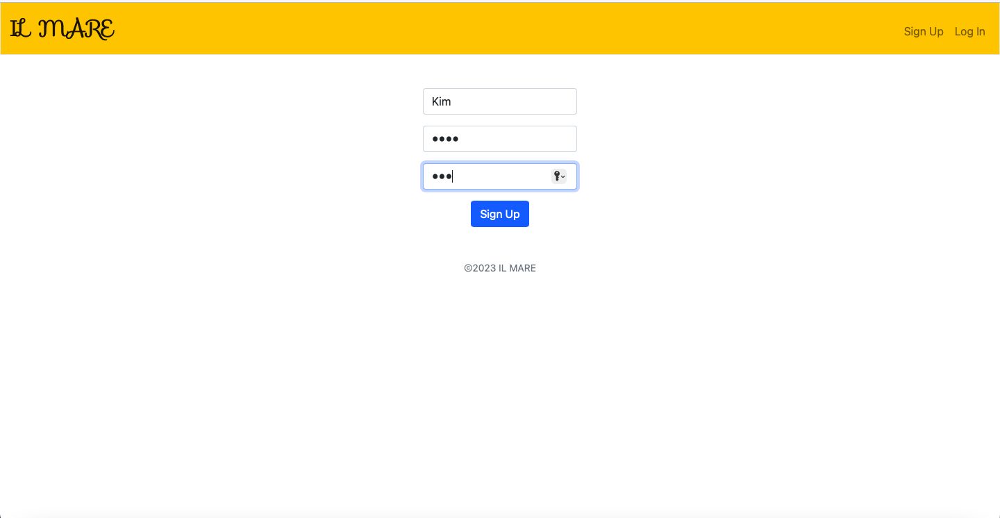
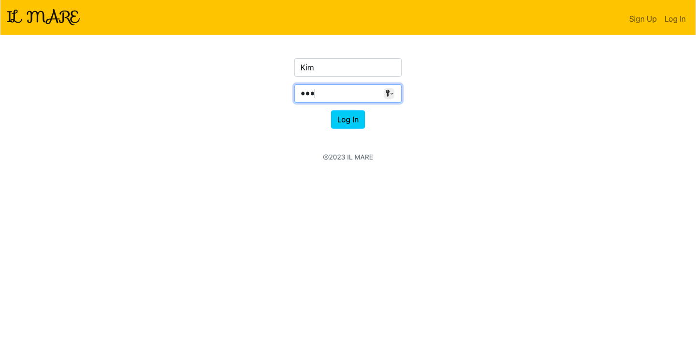
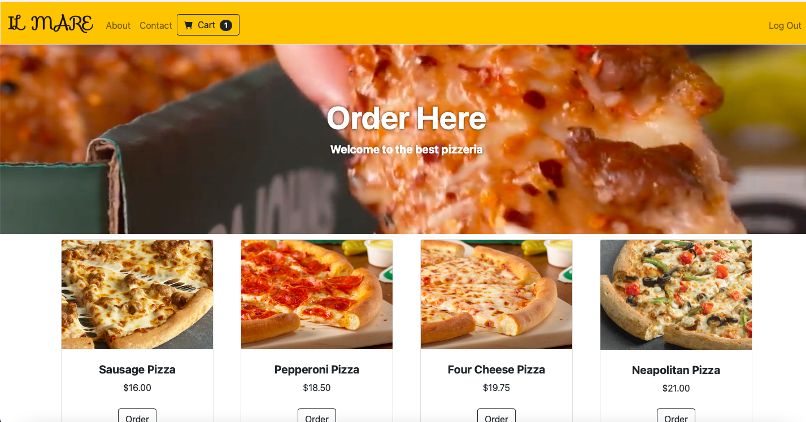
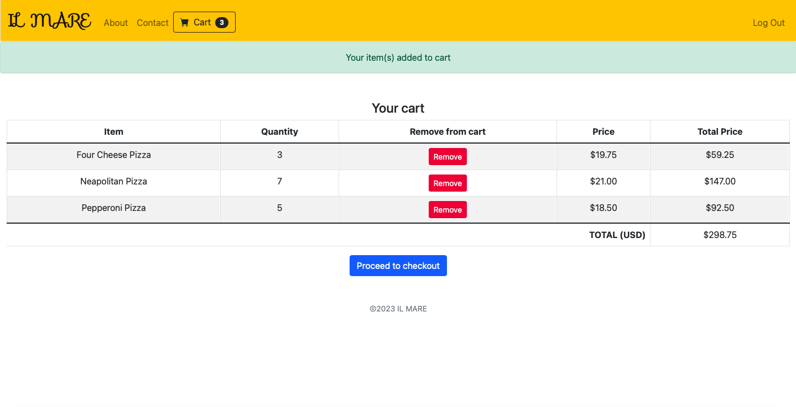
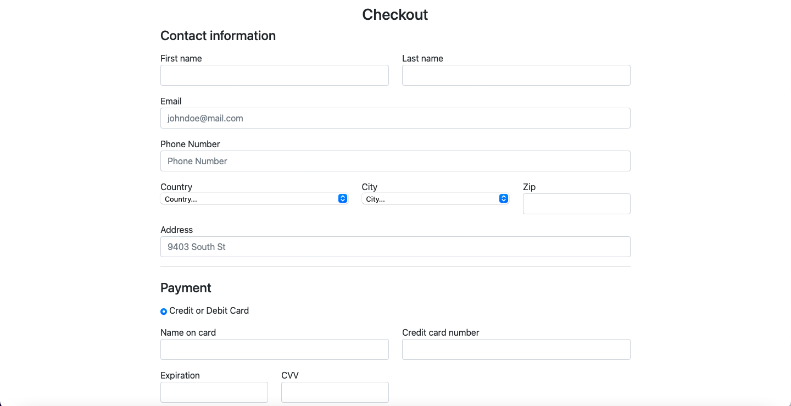
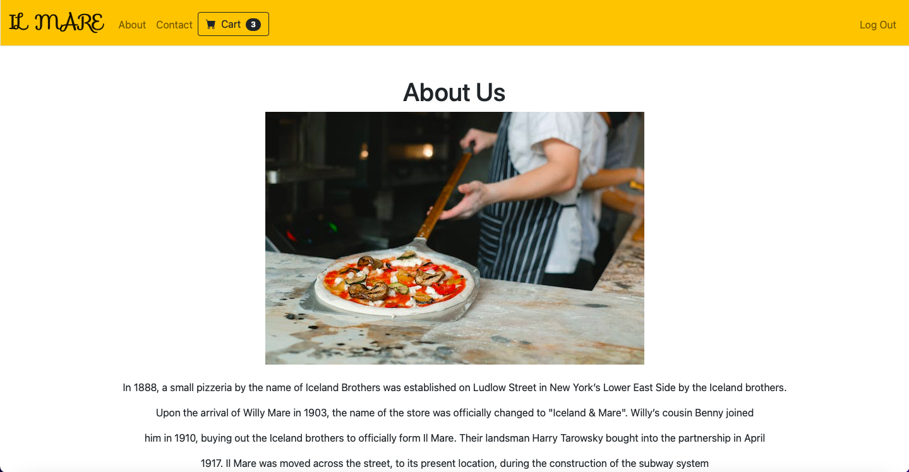
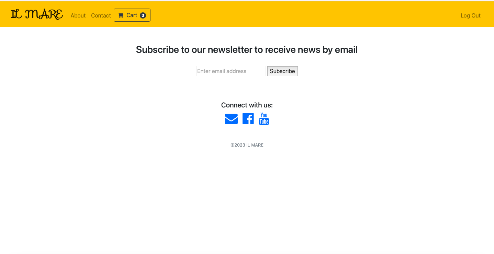

# CS50 Final Project
#### Video Demo:  <https://www.youtube.com/watch?v=68q4YAu2Dls>
#### Description:
Pizzeria Il Mare is an application, where a user can order pizza delivery online.
In 'Pizzeria' directory I made "project" directory with the following blueprints in here: 'orders', 'users', 'products' and 'main'. 

In _'init.py'_ I created a Flask app object with `create_app()`. `inject_quantity()` is nested in this function and allows us to see a number of items in the cart from all the routes. Apart from that, I used LoginManager (to log in, log out and sign up), current_user(to get data about a current user) and SQLAlchemy(to connect the app to a database). In 'models.py' I implemented four classes as models for Cart, Order, User and Product.

Outside 'project' directory there are 'instance' package with 'store' database in it and 'main.py' and 'helpers.py' files. 
'Main.py' initializes a Flask web application using the `create_app()` and starts that application. 'helpers.py' displays price in the format '$100.53'.

***

#### Blueprints

+ `users` contains _'init.py'_ and _'routes.py'_ , where 'login', 'logout' and 'signup' routes are defined.
+ `orders` contains _'init.py'_ and _'routes.py'_ , where 'order', 'cart', 'checkout' routes are defined. If 'checkout' works out, then 'success' routes opens. This code handles the process of ordering products
+ `main` contains _'init.py'_ and _'routes.py'_ , where 'index', 'about' and 'contact' routes are defined.

***

### Static and Templates

There are 'static' and 'templates' packages with _'style.css'_ and html files in them. 
- _'layout.html'_ is a blueprint used to arrange web pages in a well-defined manner, where you can find navigation bar, bootstrap links etc.
- You can see restaurant menu in _'index.html'_ . 
- info about pizzeria history _'about.html'_ . 
- _'contact.html'_ displays contact info as email, facebook and youtube and let you subscribe to the newsletter using an email. 
- see image, price and description of item and add items to cart in_'order.html'_ .  
- _'cart.html'_ showcases added to cart items, price for one item, total price for each and total for all of them. You can also remove item from cart as well.
- in _'checkout.html'_ you fill out a form with personal info such as address, phone number, name, credit/debit card credentials 
- _'success.html'_ shows up if everything is correctly filled out in the checkout form and lets you go back to the main page and continue shopping.
- _'signup.html'_ where you sign up, _'login.html'_ where you log in.

*** 

**requirements.txt** contains pip-installable libraries

***
#### Signup

#### Login

#### Homepage

#### Add to cart

#### Cart

#### Checkout

#### About

#### Contact

